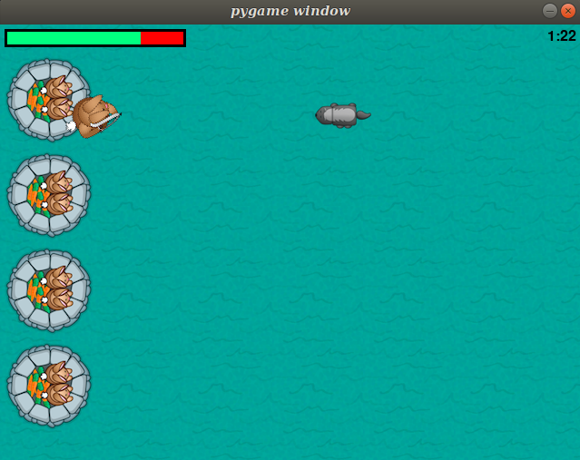

# GameOfCastles
A simple python game developed using PyGame. 

This project is done for the learning purpose with the help of [This blog](https://www.raywenderlich.com/2795-beginning-game-programming-for-teens-with-python#toc-anchor-001).

## Installations

* [Python 2.7.3](https://www.python.org/downloads/)
* [PyGame](http://www.pygame.org/download.shtml). Make sure you download a Python 2.7 version.

  

  

